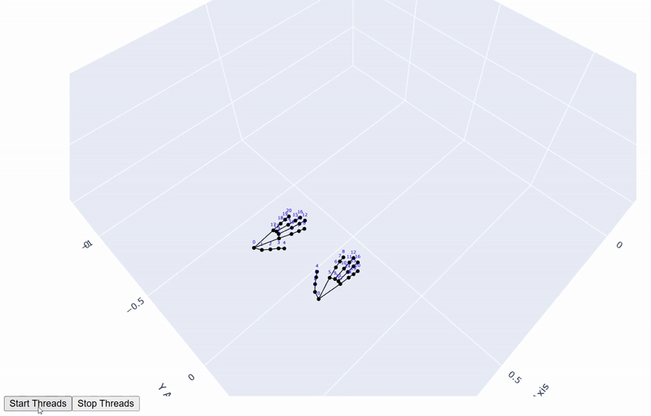

# Multicamera Handtracking

## Description
This project is aimed to combine MediaPipe Holistic and several cameras to ensure stable and persistent handtracking.
I used several depth cameras Intel RealSense to capture images of a hand from different positions.
Fusion algorithm is performed using a novel visibility concept to get preciser results.

## Example
<p align="center">
  
  
  
</p>

## Getting started

### Poetry
To run this project you need to install Python environment manager [Poetry](https://python-poetry.org/docs/).
After copying a repository you need to install release dependencies using the following command:
```
poetry install --without dev
```

### Intel RealSense
To run this project you need to make sure that depth cameras Intel RealSense are connected to your PC and do not disturb each other. This check can be done using RealSense Tools.

The latest version of RealSense SDK and RealSense Viewer can be found [here](https://github.com/IntelRealSense/librealsense/releases/tag/v2.55.1).

### Camera calibration
Before running the project it's required to calibrate available cameras and find transformation martrixes from camera coordinates to world coordinates.

You need to store points clouds obtaied during your calibration procedure for each camera in a .csv file as:
```
camera_x,camera_y,camera_z,world_x,world_y,world_z
c_x1,c_y1,c_z1,w_x1,w_y1,w_z1
c_x2,c_y2,c_z2,w_x2,w_y2,w_z2
...
```
Minimal amount of points is four. However, the larger the amoumt of points, the preciser transformation will be found.

You need to put these files in data-folder and run script to find a transformation.
```
poetry run python find_transformation.py [--mode ...]
```
Possible modes are: "mse" and "umeyama".

After that the results will be stored in transformations-folder for each camera.

### Run the project
Use the following command to start the project:
```
poetry run python async_app.py
```

## Authors and acknowledgment
Author: Ivan Khrop

This development was prepared in terms of Large Master Project at the University of Bayreuth.

Dates: 01.06.2024 - 31.05.2025.